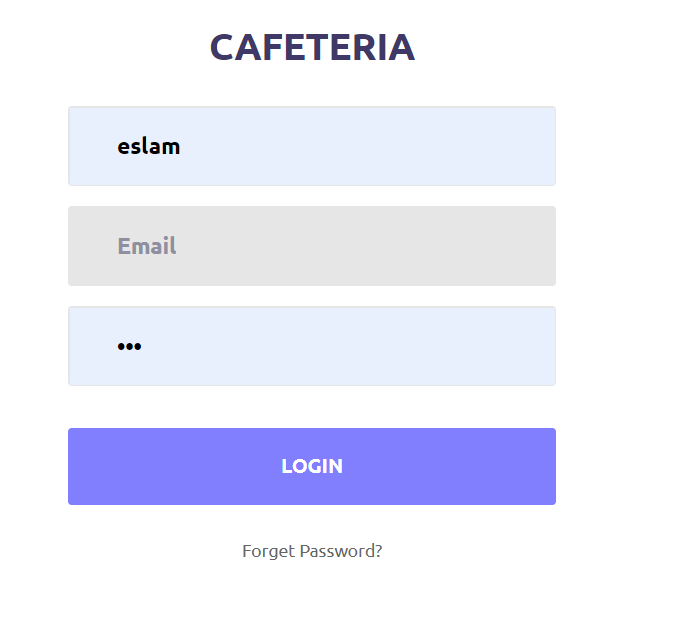
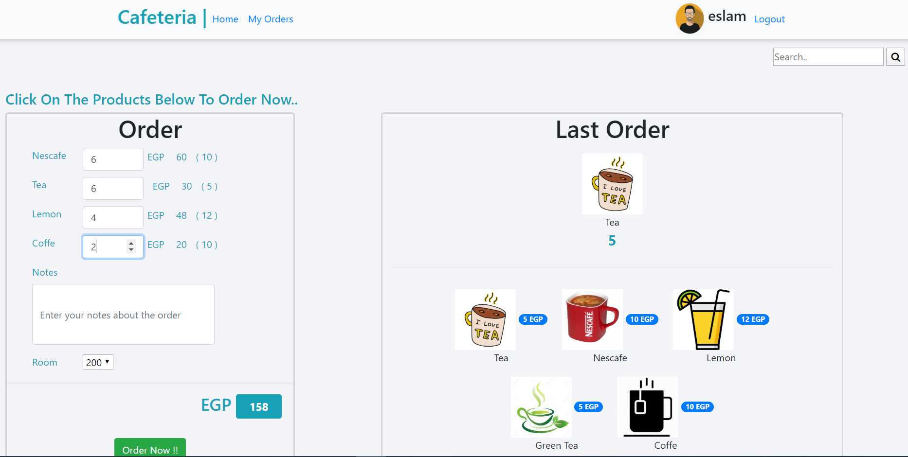
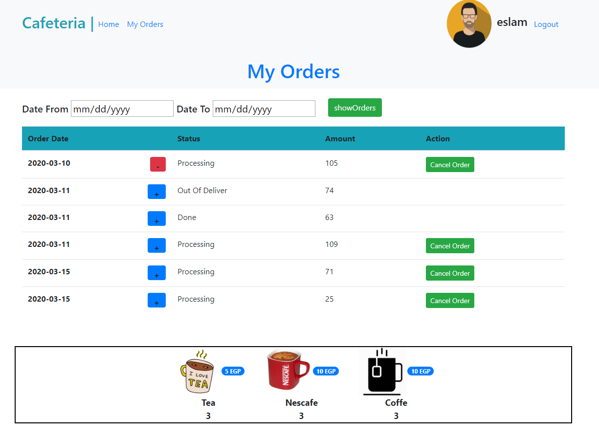

# PHP-Cafeteria-Project
### This Project about Cafeshop Management System For Users to Order Online Their Drinksts
### -Project Dependencies
<pre>
1-PHP
2-Jquery
3-MVC Design Pattern
4-Bootstrap
5-Ajax
6-HTML
7-CSS
</pre>
### 1-User Functionality
<pre>
1-User Home Page
- Can Select Any Order On Click in it
- Select amount of any Order
- See His Last Order in Home Page
- Before Submit Order Can see Total Price
2- User Orders Page
- Can See His all Orders Includes
* Status
* Date
* Total Price
* Action if want to Cancel It
- Can Choose any Order within Selected Date
- Can See His all Orders Contents Like (Team , Nescafe ,.... ) and it's Quantity
</pre>

### -Project Pictures

